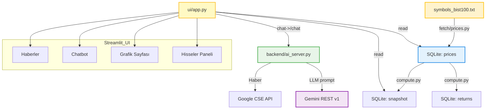

# 📈 StockWizard_AI

BIST hisseleri için **veri toplama → hesaplama → görselleştirme → sohbet** zinciri sunan uçtan uca bir mini platform. Yahoo Finance API'den veri çeker, SQLite ile saklar, Gemini AI ile Türkçe finans asistanı sunar ve Streamlit arayüzü ile görselleştirir.

## 🚀 Kullanılan Teknolojiler

| Teknoloji/Araç     | Açıklama                                | Logo                                                                                                 |
|--------------------|-----------------------------------------|------------------------------------------------------------------------------------------------------|
| **Yahoo Finance API** | BIST hisse senedi verileri           |                          |
| **SQLite**         | Hafif veritabanı çözümü                 |                                        |
| **Gemini AI** | Google'ın LLM modeli |  |
| **Streamlit**      | Web UI framework                        |        |
| **FastAPI**        | Backend API framework                   |                               |
| **Python**         | Ana programlama dili                    |                            |
| **Google CSE**     | Haber arama motoru                      |           |

- 📊 **Yahoo Finance** — BIST hisse senedi fiyat verileri
- 🗄️ **SQLite** — Hafif ve hızlı veri saklama
- 🤖 **Gemini AI** — Türkçe finans asistanı
- 🎨 **Streamlit** — Kullanıcı dostu web arayüzü
- ⚡ **FastAPI** — Hızlı ve modern API backend
- 📰 **Google CSE** — Güncel haber araması
- 🐍 **Python** — Tüm scriptler ve hesaplamalar



---

## 📁 Proje Dizini

```
StockWizard_AI/
├── backend/
│   └── ai_server.py                    # FastAPI backend server (Gemini AI + haber arama)
├── data/
│   ├── movers.db                       # SQLite veritabanı
│   └── symbols_bist100.txt             # BIST100 hisse sembolleri
├── fetch/
│   ├── compute.py                      # Getiri hesaplamaları ve snapshot oluşturma
│   └── prices.py                       # Yahoo Finance'den fiyat verisi çekme
├── ui/
│   ├── app.py                          # Ana Streamlit uygulaması
│   └── news.py                         # Haber arama modülü
├── run.sh                              # Tüm sistemi başlatan script
├── setup.sh                            # Kurulum scripti
├── requirements.txt                    # Python bağımlılıkları
├── .env.example                        # Ortam değişkenleri örneği
└── README.md                           # Bu dosya
```

---

## ⚙️ Kurulum

### 1. Ortam Değişkenleri

Proje kök dizininde `.env` dosyası oluştur:

```env
# LLM (Gemini REST v1)
LLM_BACKEND=gemini
GOOGLE_API_KEY=YOUR_GOOGLE_AI_STUDIO_KEY
GEMINI_MODEL=gemini-1.5-flash-8b

# Google Programmable Search (Haberler)
GOOGLE_CSE_KEY=YOUR_GOOGLE_CUSTOM_SEARCH_API_KEY
GOOGLE_CSE_ID=YOUR_SEARCH_ENGINE_ID

# Opsiyonel
SW_DB_PATH=./data/movers.db
RUN_MAX_SYMBOLS=100000
RUN_INIT_DAYS=800
```

**API Anahtarları:**
- **GOOGLE_API_KEY**: Google AI Studio'dan Gemini API anahtarı
- **GOOGLE_CSE_KEY**: Google Cloud Console → Custom Search API
- **GOOGLE_CSE_ID**: Programmable Search Engine kimliği

---

### 2. Hızlı Başlangıç

```bash
# 1) Sanal ortam oluştur
python -m venv .venv && source .venv/bin/activate

# 2) Bağımlılıkları yükle
pip install -r requirements.txt

# 3) .env dosyasını hazırla
cp .env.example .env   # yukarıdaki örneğe göre doldur

# 4) Tüm sistemi başlat
bash run.sh
```

**Erişim:**
- **UI**: http://localhost:8501
- **API**: http://localhost:8008/docs

---

## 🚀 Sistem Akışı

### 1. Veri Toplama
```bash
python fetch/prices.py
```
- Yahoo Finance Chart API'den BIST hisse verilerini çeker
- Retry mekanizması ile hata toleransı
- SQLite `prices` tablosuna UPSERT yapar

### 2. Hesaplama ve İşleme
```bash
python fetch/compute.py
```
- Dönemsel getirileri hesaplar (1g/1h/1a/3a/6a/1y)
- `returns` ve `snapshot` tablolarını günceller
- 52 haftalık yüksek/düşük seviyelerini analiz eder

### 3. Backend API
```bash
python backend/ai_server.py
```
**FastAPI Endpoints:**
- `GET /health` → Sistem durumu ve tablo bilgileri
- `POST /chat` → AI asistan ile sohbet

**AI Asistan Özellikleri:**
- 🔥 **Hızlı Kurallar**: "bugün en çok yükselen 10", "1y en çok düşen 7"
- 🧠 **LLM Analizi**: Karmaşık sorular için Gemini AI
- 📰 **Haber Araması**: "haber" içeren sorgular için Google CSE

### 4. Web Arayüzü
```bash
streamlit run ui/app.py
```

**Sayfa Yapısı:**
- 📊 **Hisseler**: Performans metrikleri ve sıralama
- 📈 **Grafik**: Seçili hisse için fiyat ve hacim grafikleri
- 🤖 **Chatbot**: AI asistan ile etkileşim
- 📰 **Haberler**: Hisse bazlı güncel haber araması

---

## 🔁 Veri Akışı Detayları

### Veritabanı Şeması (SQLite)

| Tablo      | Açıklama                              | Alanlar                                                           |
|------------|---------------------------------------|-------------------------------------------------------------------|
| `prices`   | Ham fiyat verileri                    | symbol, date, open, high, low, close, adj_close, volume          |
| `returns`  | Dönemsel getiri verileri              | symbol, asof, r_1d, r_1w, r_1m, r_3m, r_6m, r_1y                 |
| `snapshot` | Güncel durum özeti                    | symbol, last_price, r_1d, r_1w, r_1m, r_3m, r_6m, r_1y, vol_z, hi_52w, lo_52w, pct_from_hi, pct_from_lo, asof |
| `symbols`  | Hisse bilgileri (opsiyonel)          | symbol, short_name, long_name                                     |

### Örnek API Kullanımı

```bash
# Sistem durumu
curl http://localhost:8008/health

# AI asistan ile sohbet
curl -X POST http://localhost:8008/chat \
  -H "Content-Type: application/json" \
  -d '{"message":"1y en çok düşen 7 hisse"}'

# Haber araması
curl -X POST http://localhost:8008/chat \
  -H "Content-Type: application/json" \
  -d '{"message":"THYAO haber"}'
```

---

## ✅ Örnek Çıktılar

### Hızlı Kural Yanıtı
```json
{
  "response": "📈 1 yıllık en çok düşen 7 hisse:\n\n1. SYMBOL1 → -45.2%\n2. SYMBOL2 → -38.7%\n3. SYMBOL3 → -35.1%\n..."
}
```

### AI Analiz Yanıtı
```json
{
  "response": "BIST100'de teknoloji hisselerinin performansı son 3 ayda karışık seyir izliyor. Özellikle..."
}
```

---

## 🔧 Sorun Giderme

| Sorun                           | Çözüm                                                    |
|---------------------------------|----------------------------------------------------------|
| **Türkçe karakterler bozuk**   | `sed -i 's/\r$//' ui/*.py backend/*.py`                 |
| **Haber sonuç gelmiyor**       | Google CSE API anahtarları ve kota kontrolü             |
| **Chat 1 sonuç döndürüyor**    | Soruda sayı belirtin: "en çok yükselen 10"              |
| **Backend bağlanmıyor**        | `python backend/ai_server.py` çalışıyor mu kontrol et   |
| **Veri güncel değil**          | `python fetch/prices.py && python fetch/compute.py`     |

---

## 📊 Performans Metrikleri

| Metrik              | Açıklama                                          | Yorum                                                     |
|---------------------|---------------------------------------------------|-----------------------------------------------------------|
| `r_1d`              | 1 günlük getiri                                   | Günlük momentum göstergesi                                |
| `r_1w`              | 1 haftalık getiri                                 | Kısa vadeli trend                                         |
| `r_1m`              | 1 aylık getiri                                    | Orta vadeli performans                                    |
| `r_3m`, `r_6m`      | 3 ve 6 aylık getiri                              | Mevsimsel performans analizi                              |
| `r_1y`              | 1 yıllık getiri                                   | Uzun vadeli yatırım performansı                           |
| `vol_z`             | Hacim Z-skoru                                     | Normalden ne kadar fazla işlem gördüğü                    |
| `pct_from_hi`       | 52 haftalık yüksekten uzaklık (%)                | Direnç seviyesi analizi                                   |
| `pct_from_lo`       | 52 haftalık düşükten uzaklık (%)                 | Destek seviyesi analizi                                   |

---

## 📌 Önemli Notlar

> ⚠️ **Yasal Uyarı**: Bu proje yatırım tavsiyesi değildir. Yalnızca geçmiş fiyat hareketlerini analiz eder.

- **Veri Kaynağı**: Yahoo Finance Chart API (REST)
- **Güncelleme**: Manuel olarak `run.sh` ile
- **Kapasite**: BIST100 hisseleri için optimize edildi
- **Dil**: Türkçe arayüz ve AI asistan
- **Lisans**: Eğitim ve kişisel kullanım